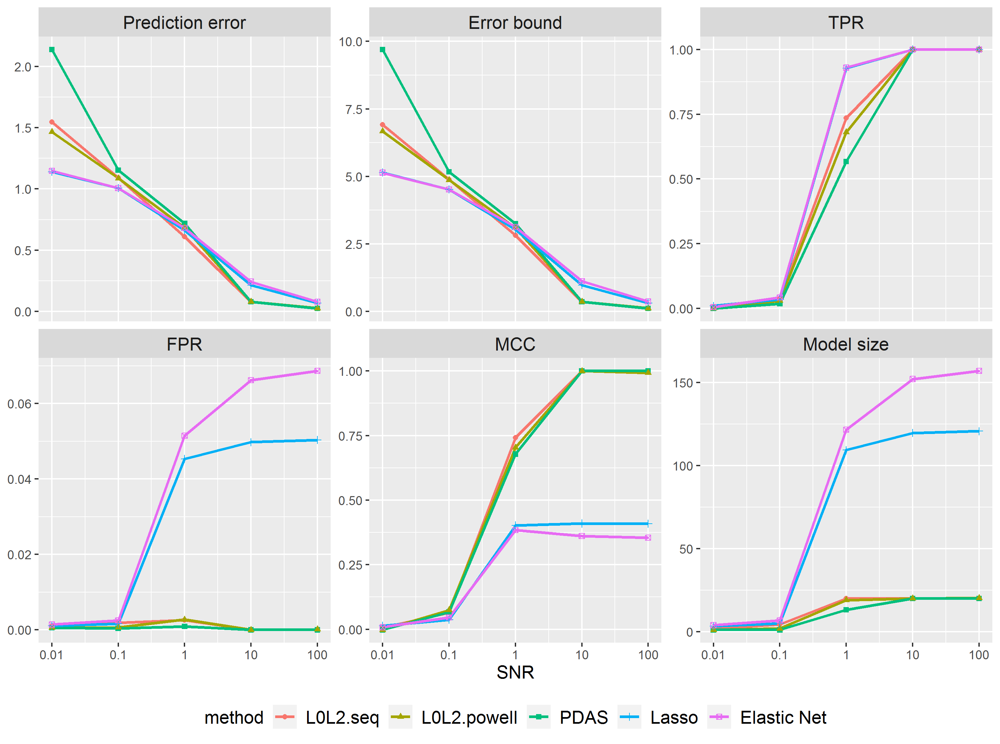
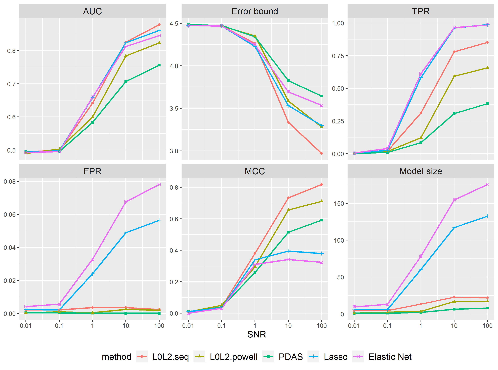

```{r, include = FALSE}
knitr::opts_chunk$set(
  collapse = TRUE,
  comment = "#>",
  warning = F,
  message = F
)
```

## 1 Introduction

One of the main tasks of statistical modeling is to exploit the association between a response variable and multiple predictors. The linear model (LM), a simple parametric regression model, is often used to capture linear dependence between response and predictors. As the extensions of the linear model, the other two common models: generalized linear model (GLM) and Cox's proportional hazards (CoxPH) model, depending on the types of responses, are modeled with mean linear to the inputs. When the number of predictors is large, parameter estimations in these models can be computationally burdensome. At the same time, a Widely accepted heuristic rule for statistical modeling is Occam's razor, which asks modelers to keep a good balance between the goodness of fit and model complexity, leading to a relatively small subset of important predictors.

 `BeSS` is a toolkit for best subset selection (BSS) problems and the best subset ridge regression (BSRR) problems. Under many sparse learning regimes, $L_0$ regularization can outperform commonly used feature selection methods (e.g., $L_1$ and MCP). We state the two problems as

 \begin{align*}
 \min_\beta& -2 \log L(\beta) \quad s.t. \|\beta\|_0 \leq s \quad&(BSS)\\
    \min_\beta& -2 \log L(\beta) + \lambda\Vert\beta\Vert_2^2 \quad s.t. \|\beta\|_0 \leq s \quad&(BSRR)\\

 \end{align*}

  where $\log L(\beta)$ is the log-likelihood function in the GLM case or the log partial likelihood function In the Cox model. $\Vert \beta\Vert_0$ denotes the $L_0$ norm of $\beta$, i.e., the number of non-zeros in $\beta$. The vanilla $L_0$ regularization gains the minimum-variance unbiased estimator on the active set. For restricted fits, the estimation bias is positive, and it is worthwhile if the decrease in variance exceeds the increase in bias. Here We would like to introduce the best subset ridge regression as an option of bias-variance tradeoff. This will add an $L_2$ norm shrinkage to the coefficients, the strength of which is controlled by the parameter $\lambda$. 
  The fitting is done over a grid of sparsity $s$ and $\lambda$ values to generate a regularization path. For each candidate model size and $\lambda$, the best subset ridge regression is solved by the $L_2$ penalized primal-dual active set algorithm. This algorithm utilizes an active set updating strategy via primal and dual variables and fits the sub-model by exploiting the fact that their support sets are non-overlap and complementary. For the case of `method = "sequential"` if `warms.start = "TRUE"`,  we run this algorithm for a list of sequential combination of model sizes and $\lambda$ and use the estimate from the last iteration as a warm start. For the case of `method = "psequential"` and `method = "pgsection"`, the Powell conjugate direction method is implemented. This method finds the optimal parameters by a bi-directional search along each search vector, in turn. The bi-directional line search along each search vector can be done by sequential search path or golden section search, the line search method of which is specified by `method = "psequential"` or `method = "pgsection"`. 


## 2 Quick start (for BSRR)
This quick start guide walks you through the implementation of the best subset ridge regression on linear and logistic models.

### 2.1 Regression: linear model

We apply the methods to the data set reported in @scheetz2006regulation, 
<!-- and is available in package **picasso**,  -->
which contains gene expression levels of 18975 probes obtained from 120 rats. We are interested in finding probes that are related to that of gene TRIM32 using linear regression. This gene had been known to cause Bardet-Biedl syndrome, which is a genetic disease of multiple organ systems including the retina. 
For simplicity, the number of probes is reduced to 500 by picking out maximum 500 marginal correaltion to Trim32 gene.
<!-- We take the probe from TRIM32, 1389163\_at, as the response variable, and the remaining 18975 probes predictors. Consequently, the number of dimension $p=18975$ is much greater than the number of observations $n=120$.  -->

```{r, warning=F, message=FALSE}
library(BeSS)
data("trim32")
```

Supposed we wants to fit a best subset ridge regression model with $\lambda$ taking values in 100 grid points from 100 to 0.01 and the model size between $\max \{p, n/\log(n)\}$ (the decimal portion is rounded) and 1, which is the default model size range where $p$ denotes the number of total variables and $n$ the sample size, via Generalized Information Criterion. We call the `bess` function as follows:
```{r}
lm.bsrr <- bess(x, y, type = "bsrr")
```

The fitted coefficients can be extracted by running the `coef` function. 
```{r, eval=F}
coef(lm.bsrr, sparse = TRUE)
```
To make a prediction on the new data, a `predict` function can be used as follows:
```{r, eval=F}
predict.bsrr <- predict(lm.bsrr, newx = x)
```
If the option `newx` is omitted, the fitted linear predictors are used.

### 2.2 Classification: logistic regression

We now turn to the classification task. We use the data set **duke** [@west2001predicting]. This data set contains microarray experiment for 86 breast cancer patients. We are interested in classify the patients into estrogen receptor-positive (Status = 0) and estrogen receptor-negative (Status = 1) based on the expression level of the considered genes. 
```{r, warning=FALSE, message = FALSE}
data("duke")
y <- duke$y
x <- duke[, -1]
```

Supposed we wants to do this classification based on logistic regression with a BSRR model. This can be realized through calling the `bess` function with the parameter `family = "binomial` as follows:
```{r}
logi.bsrr <- bess(x, y, family = "binomial", type = "bsrr")
```

Calling the `plot` routine on an `bess` object fitted by `type = "bsrr"` will provide a heatmap of GIC of the fitted path. 
```{r}
plot(logi.bsrr)
```

<!-- Similarly, we also fit an $L_0$ regularized model and plot the GIC for different model size as well as solution paths for each predictor using the `plot` function. The dashed line indicate the optimal model size determined by GIC. -->
<!-- ```{r} -->
<!-- logi.pdas = bess(x, y, family = "binomial") -->
<!-- plot(logi.pdas, type = "both") -->
<!-- ``` -->

<!-- Only 2 genes are thought informatively related to the AML and ALL classification based on the result of the best subset ridge regression model and the best subset selection. -->

<!-- Again, to evaluate the performance of the best subset ridge regression, we randomly partition the data into a training set consisting of 2/3 observations and a test set consisting of the remaining. We then fit the model with the training set and calculate the area under the ROC curve (AUC) for the test set. 20 replicas are conducted. -->
<!-- ```{r, warning=F, message=FALSE} -->
<!-- #library(ROCR) -->

<!-- logi.compare = function(i, x, y){ -->
<!--   set.seed(i) -->
<!--   training_index = sample(1:nrow(x), nrow(x)*2/3) -->
<!--   x_train = x[training_index, ] -->
<!--   y_train = y[training_index] -->
<!--   x_test = x[-training_index, ] -->
<!--   y_test = y[-training_index] -->
<!--   logi.l0l2 = bess(x_train, y_train, family = "binomial", type = "bsrr", lambda.max = 10, lambda.min = 0.01) -->
<!--   logi.pdas = bess(x_train, y_train, family = "binomial") -->
<!--   prediction_l0l2=predict(logi.l0l2, newx = x_test) -->
<!--   pred_l0l2=prediction(prediction_l0l2,y_test) -->
<!--   auc_l0l2 = unlist(slot(performance(pred_l0l2,'auc'),"y.values")) -->
<!--   prediction_pdas=predict(logi.pdas, newx = x_test) -->
<!--   pred_pdas=prediction(prediction_pdas,y_test) -->
<!--   auc_pdas = unlist(slot(performance(pred_pdas,'auc'),"y.values")) -->

<!--   res_l0l2 = c(AUC = auc_l0l2, ms = length(which(logi.l0l2$beta!=0))) -->
<!--   res_pdas = c(AUC = auc_pdas, ms = length(which(logi.pdas$beta!=0))) -->
<!--   return(rbind(res_l0l2, res_pdas)) -->
<!-- } -->
<!-- # res = lapply(1:2, logi.compare, x, y) -->
<!-- # res = simplify2array(res) -->
<!-- # mean_res = apply(res, c(1, 2), mean) -->
<!-- # print(mean_res) -->
<!-- ``` -->

<!-- Again, the best subset ridge regression tends to predict better and chose fewer predictors than the best subset selection, which is no surprise as an extra $L_2$ penalty plays an rule as coefficient shrinkage. -->

## 3 Advanced features

### 3.1 Censored response: Cox proportional hazard model

The `BeSS` package also supports studying the relationship between predictors variables and survival time based on the Cox proportional hazard model. We now demonstrate the usage on a real data set, Alizadeh, Eisen, Davis, Ma, Lossos, Rosenwald, Boldrick, Sabet, Tran, Yu et al. (2000)[@alizadeh2000distinct]: gene-expression data in lymphoma patients. There were 240 patients with measurements on 7399 probes.
```{r, warning=FALSE, message = FALSE}
data(LymphomaData, package = "HCmodelSets")

x <- t(patient.data$x)
y <- patient.data$time
status <- patient.data$status
```

To implement the best subset ridge regression on the Cox proportional hazard model, call the `bess` function with `family` specified to be `"cox"`.
```{r}
cox.bsrr <- bess(x, cbind(y, status), family = "cox", type = "bsrr")
```

We use the `summary` function to draw a summary of the fitted `bess` object. 28 probes among the total 7399 are selected according to the result.
```{r}
summary(cox.bsrr)
```

### 3.2 Criterion for tuning parameters selection

    + Information criterion: AIC, BIC, GIC, EBIC
    
    + Cross-validation
    
  So far, we have been stick to the default Generalized Information Criterion for tuning parameter selections. In this package, we provide a bunch of criteria including the Akaike information criterion [@akaike1974new] and Bayesian information criterion [@schwarz1978estimating], Generalized Information Criterion [@konishi1996generalised], and extended BIC [@chen2008extended; @chen2012extended], as well as cross-validation. By default, `bess` selects the tuning parameters according to the Generalized Information Criterion.     
  
  To choose one of the information criteria to select the optimal values of model size $s$ and shrinkage $\lambda$, the input value `tune` in the `bess` function needs to be specified: 
    
```{r, eval=F}
lm.bsrr.ebic <- bess(x, y, type = "bsrr", tune = "ebic")
```

To use cross-validation for parameter selections, set the input value of `tune = "cv"`. By default, 5-fold cross-validation will be conducted. 
```{r, eval=F}
lm.bsrr.cv <- bess(x, y, type = "bsrr", tune = "cv", nfolds = 5)
```

### 3.3 Paths for tuning parameters selection

    + Sequential method
    
    + Powell's method
    
We shall give a more explicit description of the parameters tuning paths. As mentioned in the introduction, we either apply a `method = "sequential"` path for examining each combination of the two tuning parameters $s$ and $\lambda$ sequentially and chose the optimal one according to certain information criteria or cv, or a less computational burdensome Powell method (`method = "psequential"` or `method = "pgsection"`). The initial starting point $x_0$ of the Powell method is set to be the $(s_{min}, \lambda_{min})$, and the initial search vectors $v_1, v_2$ are the coordinate unit vectors. The method minimizes the value of chosen information criterion or cross-validation error by a bi-directional search along each search vector on the 2-dimensional tuning parameter space composed of $s$ and $\lambda$, in turn. Callers can choose to find the optimal combination along each search vector sequentially or conducting a Golden-section search by setting `method = "psequential"` or `method = "pgsection"`. If `warm.start = TRUE`, we use the estimate from the last iteration in the PDAS algorithm as a warm start. 

By default, the tuning parameters are determined by the Powell method through a golden-section line search and we exploit warm starts. The minimum $\lambda$ value is set to be 0.01 and the maximum 100. The maximum model size is the smaller one of the total number of variables $p$ and $n/\log (n)$. Advanced users of this toolkit can change this default behavior and supply their own tuning path. 

To conduct parameter selections sequentially, users should specify the method to be "sequential" and provide a list of $\lambda$ to the `lambda.list` as well as an increasing list of model size to the `s.list`.

```{r, eval=F}
my.lambda.list <- exp(seq(log(10), log(0.01), length.out = 10))
my.s.list <- 1:10

lm.bsrr.seq <- bess(x, y, type = "bsrr", method = "sequential", s.list = my.s.list,
                   lambda.list = my.lambda.list)
```

To conduct parameter selections using the Powell method on a user-supplied tuning parameter space, users should assign values to `s.min`, `s.max`, `lambda.min`, and `lambda.max`. 100 values of $\lambda$ will be generated decreasing from `lambda.max` to `lambda.min` on the log scale. Here we do the line search sequentially.
```{r, eval=F}
my.s.min <- 1
my.s.max <- 10
my.lambda.min <- 0.01
my.lambda.max <- 10

lm.bsrr.powell <- bess(x, y, type = "bsrr", method = "pgsection", 
                      s.min = my.s.min, s.max = my.s.max, 
                      lambda.min = my.lambda.min, lambda.max = my.lambda.max)
```

### 3.4 Sure independence screening

We also provide feature screening option to deal with ultrahigh dimensional data for computational and statistical efficiency. Users can apply the sure independence screening method [@saldana2018sis] based on maximum marginal likelihood estimators, to pre-exclude some irrelevant variables before fitting a model by pressing a integer to `screening.num`. The SIS will filter a set of variables with size equals to `screening.num`. Then the active set updates are restricted on this set of variables.
```{r, eval=F}
lm.bsrr.screening <- bess(x, y, type = "bsrr", screening.num = round(nrow(x)/log(nrow(x))))
```

## 4 Monte carol study

### 4.1 Settings

In this section, we will conduct a monte carol study on our proposed best subset ridge regression method and make a comparison with other commonly used variable selection methods in three aspects. The first aspect is the predictive performance on a held-out testing data of the same size of training data. For linear regression, this is defined as $\frac{\Vert X \beta^\dagger - X \hat{\beta}\Vert _2}{\Vert X \beta^\dagger\Vert_2}$, where $\beta^\dagger$ is the true coefficient and $\hat{\beta}$ is an estimator. For logistic regression, we calculate the classification accuracy by the area under the ROC curve (AUC). The second aspect is the coefficient estimation performance defined as $\Vert \beta^\dagger - \hat{\beta}\Vert$, where $\beta^\dagger$ denote the underlying true coefficients and $\beta^\dagger$ is out estimation. The third aspect is the selection performance in terms of true positive rate (TPR), false positive rate (FPR), the Matthews correlation coefficient (MCC) score, and the model size.

We generate a multivariate Gaussian data matrix $X_{n\times p} \sim MVN(0, \Sigma)$ and consider the variables to have exponential correlation. $n$ denotes the sample size and $p$ the number of total variables, and we set $n = 200$, $p = 2000$. We consider the following instance of $\Sigma := ((\sigma_{ij}))$, setting each entry $\sigma_{ij} = 0.5 ^{|i-j|}$. We use a sparse coefficient vector $\beta^\dagger$ with $20$ equi-spaced nonzero entries, each set to 1. Then the response vector y is generated with gaussian noise added. For linear regression, $y = X\beta^\dagger+\epsilon$. For logistic regression, $y = Bernoulli(Pr(Y=1))$, where $Pr(Y=1) = \exp (x^T \beta^\dagger + \epsilon)/(1+\exp (x^T \beta^\dagger + \epsilon))$. $\epsilon\sim N(0, \sigma^2)$ is independent of $X$. We define the signal-to-noise ratio (SNR) by SNR = $\frac{Var(X\beta^\dagger)}{Var(\epsilon)} = \frac{\beta^{\dagger T} \Sigma \beta^\dagger}{\sigma^2}$.

we compare the performance of the following methods:

i. (BSRR methods): Tuning parameters selected through a sequential path and the Powell method. Denoted as Grid-BSRR and Powell-BSRR.

ii. (BSS method): The best subset selection method. We consider the primal-dual active subset selection method and use our own implementation in `BeSS` package.

iii. ($L_1$ method): Lasso estimator. We use the implementation of **glmnet**.

iv. ($L_1L_2$ method): Elastic net estimator. This uses a combination of the $L_1$ and $L_2$ regularization. We use the implementation of **glmnet**. 

For BSRR estimators, the 2D grid of tuning parameters has $\lambda$ taking 100 values between $\lambda_{max}$ and $\lambda_{min}$ on a log scale. The $\lambda_{max}$ and $\lambda_{min}$ will be specified. For the BSS method, the model size parameter takes value in $\{1, \dots, 30\}$. The parameter combined the $L_1$ penalty and the $L_2$ penalty in the Elastic net is fixed at $0.5$. And for $L_1$ and $L_1L_2$ methods, we use the default settings. The regularization parameters are chosen by 5-fold cross-validation. 

### 4.2 Linear regression 

Results for linear regression are reported in Figure 1. When SNR is low, BSS has the largest estimation error and selects the smallest model size compared with other methods, while the extra $L_2$ penalty in BSRR has effectively lowered the estimation error of BSS. For high SNR, the performance of BSS and BSRR is similar to each other. In terms of prediction error, all methods are good in the high SNR scenario, but it costs the Lasso and the Elastic Net a very dense supports while still cannot catch up with BSS and BSRR. Notice that for SNR 100, the selected model size of the Elastic Net is almost 7 times the true model size. This trend is no better for the Lasso. Of all measures across the whole SNR range, BSRR generally exhibits excellent performance—accurate in variables selection and prediction.




<center>Figure 1: Performance measures as the signal-to-noise ratio (SNR) is varied between
0.01 and 100 for linear regression.</center>

### 4.3 Logistic regression

Results for linear regression are reported in Figure 2. The result shows that as the SNR rises, the extra shrinkage in BSRR methods helps the best subset ridge regression make impressive improvement in terms of prediction accuracy, estimation ability, and variable selection, where it outperforms the state-of-the-art variable selection methods Lasso and Elastic Net.




<center>Figure 2: Performance measures as the signal-to-noise ratio(SNR)is varied between
0.01 and 100 for logistic regression.</center>

## 5 Conclusion

In the `BeSS` toolkit, we introduce the best subset ridge regression for solving the $L_2$ regularized best subset selection problem. The $L_2$ penalized PDAS algorithm allows identification of the best sub-model with a prespecified model size and shrinkage via a primal-dual formulation of feasible solutions. To determine the best sub-model over all possible model sizes and shrinkage parameters, both a sequential search method and a powell search method are provided. We find that estimators BSRR models do a better job than the BSS estimator and usually outperform other variable selection methods in prediction, estimation and variable selection. 

## References


